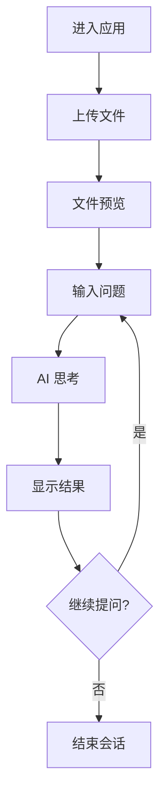

# ChatTable AI 对话应用产品需求文档

## 1. 产品概述

ChatTable 是一个智能表格数据分析对话应用，让用户通过自然语言与表格数据进行交互。用户可以上传 Excel 或 CSV 文件，然后通过对话的方式进行数据查询、计算和分析，大大降低了数据分析的门槛。

该产品旨在为非技术用户提供简单易用的数据分析工具，通过 AI 技术让数据分析变得像聊天一样简单。

## 2. 核心功能

### 2.1 用户角色

本产品为单用户应用，无需区分用户角色，所有用户都具有相同的功能权限。

### 2.2 功能模块

我们的 ChatTable 应用包含以下主要页面：

1. **主界面**：文件上传区域、聊天输入框、消息展示区域
2. **文件预览页面**：表格数据展示、数据统计信息
3. **对话页面**：问答历史、思考过程展示、结果展示

### 2.3 页面详情

| 页面名称 | 模块名称 | 功能描述 |
|---------|---------|---------|
| 主界面 | 文件上传区域 | 支持拖拽上传 Excel/CSV 文件，文件格式验证，上传进度显示 |
| 主界面 | 聊天输入框 | 文本输入、发送按钮、输入状态提示 |
| 主界面 | 消息展示区域 | 显示用户问题和 AI 回答，支持 Markdown 渲染 |
| 文件预览页面 | 表格展示 | 以表格形式展示文件内容，最多显示前 200 行数据 |
| 文件预览页面 | 数据统计 | 显示文件基本信息（行数、列数、文件大小等） |
| 对话页面 | 思考过程展示 | 可折叠的 AI 思考过程，支持 Markdown 渲染 |
| 对话页面 | 结果展示 | AI 分析结果，支持代码块、表格、图表等 Markdown 语法 |
| 对话页面 | 问答历史 | 保存当前会话的所有问答记录，支持滚动查看 |

## 3. 核心流程

**主要用户操作流程：**

1. 用户进入应用，看到简洁的聊天界面
2. 用户通过拖拽或点击上传 Excel/CSV 文件
3. 文件上传成功后，界面自动分割为左右两部分
4. 左侧显示文件预览，右侧保持聊天界面
5. 用户在右侧输入关于数据的问题
6. AI 开始思考并显示思考过程（可折叠）
7. AI 返回分析结果，思考过程自动收起
8. 用户可以继续提问，进行多轮对话

## 4. 用户界面设计

### 4.1 设计风格

- **主色调**：#2563eb（蓝色）作为主色，#f8fafc（浅灰）作为背景色
- **辅助色**：#64748b（中性灰）用于次要文本，#10b981（绿色）用于成功状态
- **按钮样式**：圆角按钮，悬停时有阴影效果
- **字体**：系统默认字体栈，主要文本 14px，标题 18px
- **布局风格**：卡片式布局，左右分栏设计，顶部导航
- **图标风格**：使用 Lucide React 图标库，线性风格图标

### 4.2 页面设计概览

| 页面名称 | 模块名称 | UI 元素 |
|---------|---------|---------|
| 主界面 | 文件上传区域 | 虚线边框的拖拽区域，上传图标，提示文字，进度条 |
| 主界面 | 聊天输入框 | 圆角输入框，发送按钮（蓝色），字符计数 |
| 主界面 | 消息展示区域 | 用户消息（右对齐，蓝色背景），AI 消息（左对齐，白色背景） |
| 文件预览页面 | 表格展示 | 带边框的表格，斑马纹行，固定表头，滚动条 |
| 文件预览页面 | 数据统计 | 卡片式信息展示，图标+数字的组合 |
| 对话页面 | 思考过程展示 | 可折叠面板，淡黄色背景，思考图标 |
| 对话页面 | 结果展示 | Markdown 渲染区域，代码高亮，表格样式，图表容器 |

### 4.3 响应式设计

产品采用桌面优先的设计策略，主要针对桌面端用户。在移动端会进行适配，将左右分栏改为上下布局，确保在小屏幕设备上也能正常使用。支持触摸交互优化，包括文件拖拽和滚动操作。