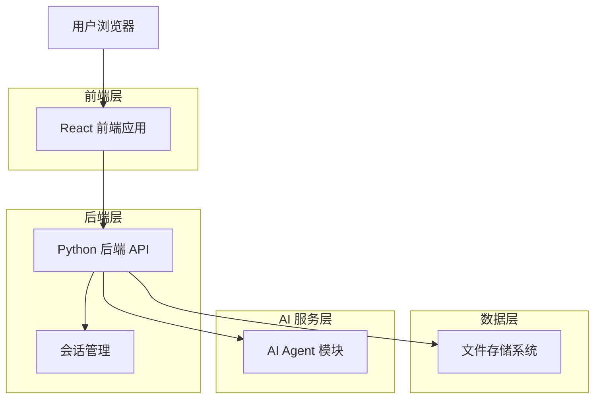
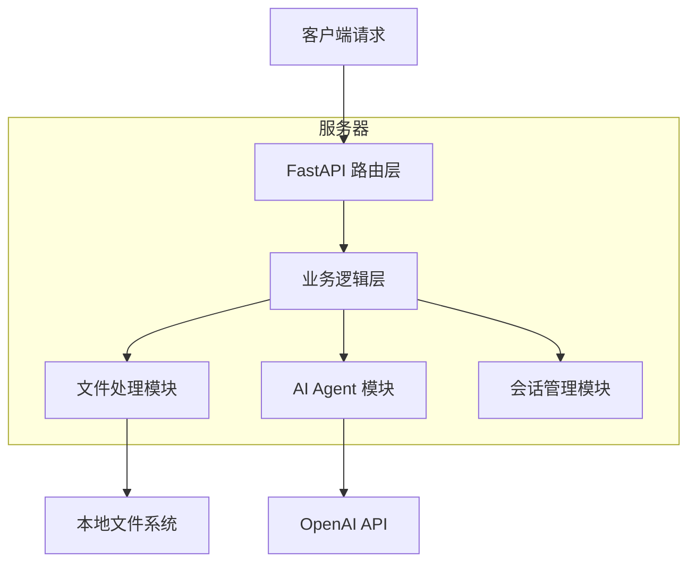
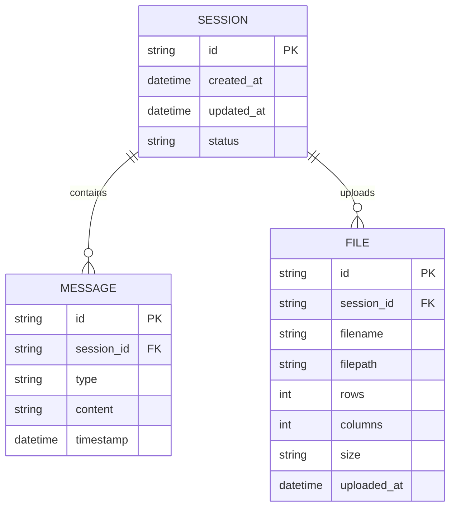

# ChatTable AI 对话应用技术架构文档

## 1. 架构设计



## 2. 技术描述

- **前端**: React@19 + TypeScript + Vite + TailwindCSS + Lucide React
- **后端**: Python + FastAPI + Pandas + OpenAI API
- **文件处理**: pandas (Excel/CSV 读取) + openpyxl (Excel 支持)
- **通信协议**: HTTP + Server-Sent Events (SSE)

## 3. 路由定义

| 路由 | 用途 |
|------|-----|
| / | 主页面，包含文件上传和聊天界面 |
| /chat/:sessionId | 特定会话的聊天界面（可选，用于会话恢复） |

## 4. API 定义

### 4.1 核心 API

**文件上传接口**
```
POST /api/upload
```

请求:
| 参数名称 | 参数类型 | 是否必需 | 描述 |
|---------|---------|---------|------|
| file | File | true | 上传的 Excel 或 CSV 文件 |
| session_id | string | false | 会话 ID，用于文件隔离 |

响应:
| 参数名称 | 参数类型 | 描述 |
|---------|---------|------|
| success | boolean | 上传是否成功 |
| session_id | string | 会话 ID |
| file_info | object | 文件基本信息 |
| preview_data | array | 预览数据（前 200 行） |

示例:
```json
{
  "success": true,
  "session_id": "sess_123456",
  "file_info": {
    "filename": "data.xlsx",
    "rows": 1000,
    "columns": 5,
    "size": "2.5MB"
  },
  "preview_data": [
    {"col1": "value1", "col2": "value2"},
    {"col1": "value3", "col2": "value4"}
  ]
}
```

**发送消息接口**
```
POST /api/chat/stream
```

请求:
| 参数名称 | 参数类型 | 是否必需 | 描述 |
|---------|---------|---------|------|
| message | string | true | 用户的问题 |
| session_id | string | true | 会话 ID |

响应: Server-Sent Events 流式响应
| 事件类型 | 数据格式 | 描述 |
|---------|---------|------|
| thinking | string | AI 思考过程（Markdown 格式） |
| response | string | AI 回答内容（Markdown 格式） |
| error | string | 错误信息 |
| done | null | 响应结束标志 |

示例:
```
data: {"type": "thinking", "content": "我需要分析这个数据..."}

data: {"type": "response", "content": "根据数据分析，结果如下：\n\n| 列名 | 平均值 |\n|------|--------|\n| 销售额 | 1000 |"}

data: {"type": "done"}
```

**获取会话历史接口**
```
GET /api/chat/history/:session_id
```

响应:
| 参数名称 | 参数类型 | 描述 |
|---------|---------|------|
| messages | array | 消息历史列表 |

## 5. 服务器架构图



## 6. 数据模型

### 6.1 数据模型定义



### 6.2 数据定义语言

由于这是一个轻量级应用，我们使用文件系统存储会话数据，不需要传统数据库。

**会话数据结构 (JSON 文件)**
```json
{
  "session_id": "sess_123456",
  "created_at": "2024-01-01T00:00:00Z",
  "updated_at": "2024-01-01T01:00:00Z",
  "status": "active",
  "file_info": {
    "filename": "data.xlsx",
    "filepath": "/uploads/sess_123456/data.xlsx",
    "rows": 1000,
    "columns": 5,
    "size": "2.5MB",
    "uploaded_at": "2024-01-01T00:00:00Z"
  },
  "messages": [
    {
      "id": "msg_001",
      "type": "user",
      "content": "这个表格有多少行数据？",
      "timestamp": "2024-01-01T00:30:00Z"
    },
    {
      "id": "msg_002",
      "type": "assistant",
      "content": "这个表格共有 1000 行数据。",
      "thinking": "用户询问行数，我需要查看文件信息...",
      "timestamp": "2024-01-01T00:30:05Z"
    }
  ]
}
```

**文件存储结构**
```
/data/
├── sessions/
│   ├── sess_123456/
│   │   ├── session.json
│   │   └── uploads/
│   │       └── data.xlsx
│   └── sess_789012/
│       ├── session.json
│       └── uploads/
│           └── report.csv
```